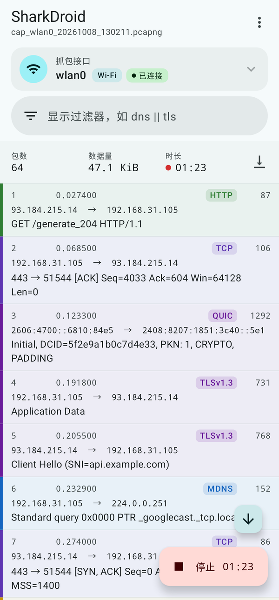
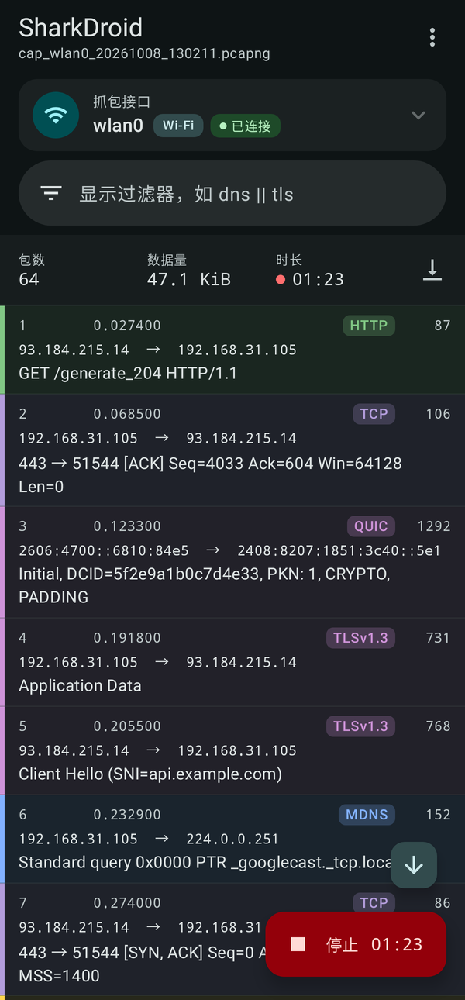
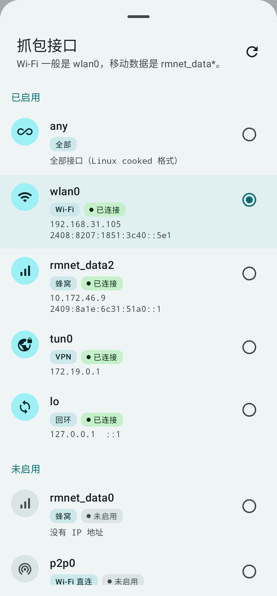
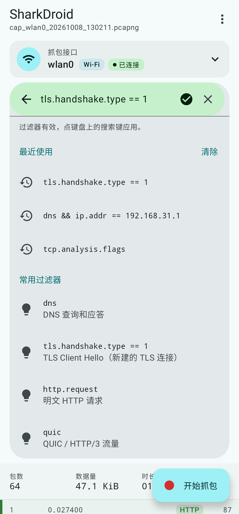
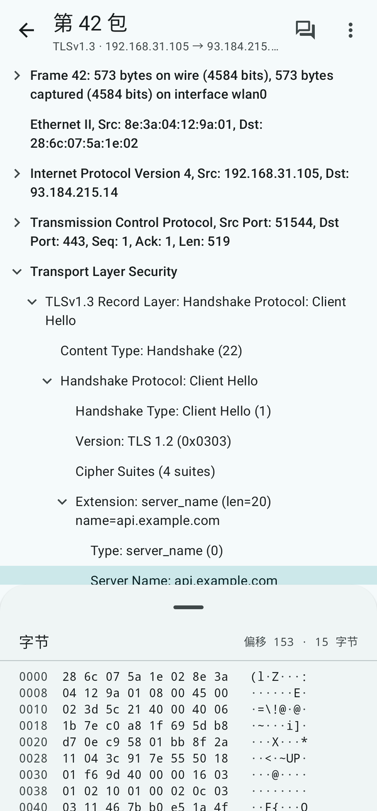
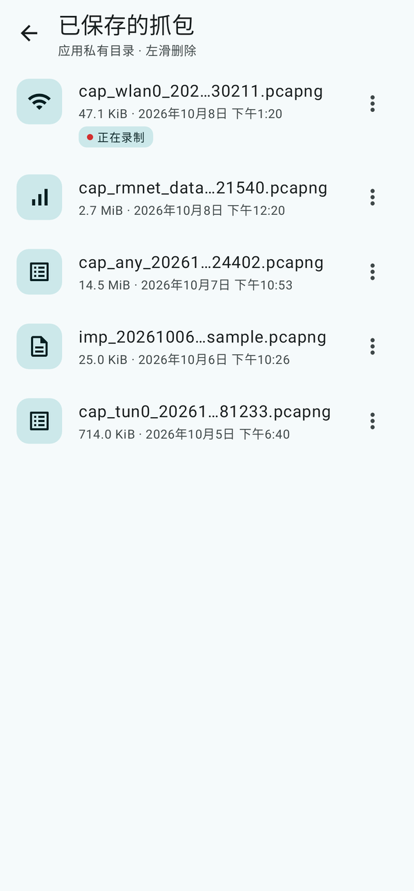
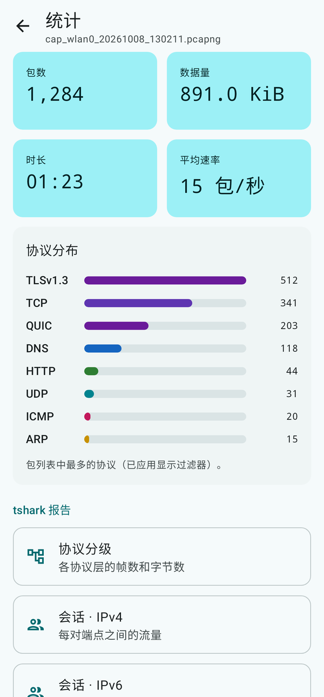
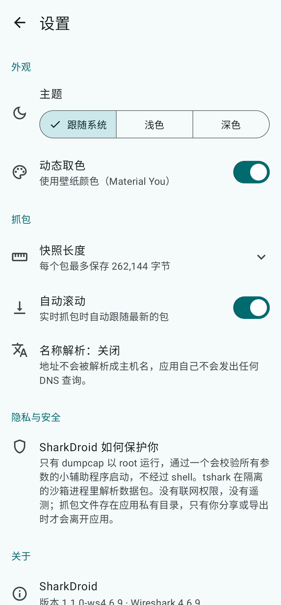

[English](README.md) | **简体中文**

# SharkDroid：Android 版 Wireshark（arm64，需要 root）

SharkDroid 把 **Wireshark 4.6.9**（2026-09 发布的最新稳定版，包含截至该版本的全部上游安全修复）里负责抓包和解析的核心带到了 Android 上：`dumpcap` 和 `tshark`，包含全部协议解析器，用 Android NDK r27c 交叉编译到 arm64-v8a（Android 10 / API 29 及以上）。外面配了一个适合手机使用的 Material 3 App，另外还有一个可以通过 adb / su 手动使用的命令行包。

> Wireshark 官方没有 Android 版。这里没有移植桌面版的 Qt 图形界面。包列表、协议树和十六进制视图是 SharkDroid 自己的界面，但所有解析结果都来自真正的 tshark。

**状态：正式版。** 命令行工具已在 Android 模拟器上验证过；App 已在 Android 真机上测试，运行正常。欢迎反馈。

<table>
  <tr><td align="center"><br><sub>包列表（浅色）</sub></td><td align="center"><br><sub>包列表（深色）</sub></td><td align="center"><br><sub>选择接口</sub></td><td align="center"><br><sub>显示过滤器</sub></td></tr>
  <tr><td align="center"><br><sub>包详情</sub></td><td align="center"><br><sub>已保存的抓包</sub></td><td align="center"><br><sub>统计</sub></td><td align="center"><br><sub>设置</sub></td></tr>
</table>

<sub>截图使用演示数据（由 JVM 截图测试渲染），不是真实抓包。</sub>

## 下载

仓库里只有源码。APK 和命令行包在 [Releases](../../releases) 页面。

| 文件 | 说明 |
|---|---|
| `SharkDroid-<版本>-wireshark-4.6.9-arm64-release.apk` | App，自签名 release 版（安装这个） |
| `sharkdroid-cli-wireshark-4.6.9-android-arm64.tar.gz` | 命令行包：`tshark`、`dumpcap`、`capinfos`、`editcap`、`mergecap` 和数据文件 |
| `SOURCES.txt` | 每个上游源码的下载地址、签名或校验结果、SHA256 和本地补丁 |
| `SHA256SUMS` | 发布文件的校验值 |
| `sharkdroid-source.tar.gz` | 本仓库在该版本标签处的源码快照 |

release APK 使用自签名证书，SHA-256 为 `72590f3238296885b7d1a2b9b600594350e5ea8477277e45fe4222985196f157`，可以用 `apksigner verify --print-certs` 核对。每个版本都用同一个证书签名，所以新版本可以直接覆盖安装旧版本。

## 安装 App

1. 在手机的开发者选项里打开 USB 调试。只有用 adb 安装时才需要；也可以把 APK 拷到手机上直接打开安装。
2. 在电脑上运行：`adb install SharkDroid-<版本>-wireshark-4.6.9-arm64-release.apk`
   - 部分 ROM 安装前会弹出“安全检查”页面，选择继续即可（App 没有联网权限）。
3. 打开 SharkDroid。第一次打开时会请求超级用户权限：
   - **Magisk**：在弹窗里点“允许”（建议选“永久”）。
   - **KernelSU / APatch**：在管理器 App 里给 SharkDroid 打开 root，然后回到 SharkDroid，点横幅上的**重试**。
4. Android 13 及以上开始抓包时会请求通知权限，用来显示带**停止**按钮的“正在抓包”通知。拒绝也能正常抓包。

不需要 `setenforce 0`，也不需要改 SELinux 策略：dumpcap 运行在 Magisk / KernelSU 的 su 域里，这个域本来就允许抓包。

## 使用

- **接口**：点顶部的接口卡片。选择面板里会显示每个接口的类型（Wi‑Fi、蜂窝、VPN、回环、全部……）和状态（已连接、无地址、未启用）：
  - `wlan0`：Wi‑Fi（以太网帧）
  - `rmnet_data0…N`：高通平台的移动数据（原始 IP，**没有以太网头**，按 DLT_RAW 解析）。开着移动数据时，活跃的一般是有 IP 地址的那个 `rmnet_dataX`。联发科平台叫 `ccmni*`。
  - `any`：所有接口一起抓（Linux cooked SLL 格式）
  - `lo`：本机回环。`tun0`：开着 VPN 时的隧道接口（看到的是 VPN 里面的明文 IP 包）。`p2p0`、`rndis0`、`ncm0`、`bt-pan`：Wi‑Fi 直连、USB 共享、蓝牙共享。
  - `rmnet_ipa0` 和 `r_rmnet_data*` 是带 QMAP 头的底层接口，一般不需要选。
  - 默认选择：Wi‑Fi 已连接时选 `wlan0`，否则选正在使用的 `rmnet_data*`，都没有时选 `any`。
- **开始抓包**：点右下角的大按钮，打开“新建抓包”面板。可以填一个可选的**捕获过滤器**（BPF 语法，如 `tcp port 443`、`host 1.2.3.4`、`udp port 53`、`not port 5555`），也可以点下面的建议。抓包时按钮变成红色的**停止**，并显示已抓时长。列表上方的状态栏显示包数、数据量和时长。
- **显示过滤器**：顶部的搜索栏，使用 Wireshark 语法，如 `dns`、`tls.handshake.extensions_server_name contains "example"`、`http.request`、`ip.addr == 1.2.3.4`、`tcp.analysis.flags`。输入时由 tshark 本身检查过滤器：有效变绿，无效变红并显示 tshark 的错误信息，和 Wireshark 一样。下面会列出最近用过的过滤器和常用过滤器。点键盘上的搜索键应用，应用后会从头重新解析文件。
- **包列表**：参考 Wireshark 着色规则按协议上色，数字用等宽字体。列表会自动跟随新包；往上滑会暂停跟随，点箭头按钮或自动滚动开关可以恢复。长按一个包，可以按它的协议或地址过滤，或者复制这一行。
- **包详情**：点一个包，可以看到可展开的协议树，包的字节显示在底部面板里（往上拖可以看更多）。点一个字段会高亮它对应的字节。长按字段可以**设为显示过滤器**、**复制过滤表达式**、**复制值**、**复制此行**。顶栏有**追踪 TCP/UDP 流**。
- **右上角菜单（⋮）**：
  - **打开文件**：通过系统文件选择器打开 pcap / pcapng 文件（不需要 root）。
  - **已保存的抓包**：打开、分享、导出、删除。左滑删除，删除后可以在提示条里点**撤销**。
  - **统计**：概要卡片、协议分布，以及 tshark 报告（协议分级、IPv4/IPv6/TCP/UDP 会话、端点、专家信息、DNS 查询列表、TLS SNI、HTTP 请求、DNS 统计、每秒 IO 统计）。
  - **导出**、**分享**、**清空包列表**
  - **推送到电脑 Wireshark**
  - **诊断**：root 状态、沙箱状态、`dumpcap -D`、接口表和最近一次 dumpcap 输出。
  - **设置**：主题（跟随系统 / 浅色 / 深色）、Material You 动态取色、快照长度、自动滚动，以及开源许可。
- 抓包时可以切到其他 App。前台服务会让抓包继续，通知栏里有**停止**按钮。按返回键也不会停止正在进行的抓包。
- 抓包文件保存在 **App 私有目录**（`/data/data/org.sharkdroid/files/captures/`），只有你**导出**（系统“另存为”）或**分享**时才会离开 App。单个文件达到 2 GiB 时自动停止。
- 界面支持简体中文和英文，跟随系统语言；Android 13 及以上也可以单独给本 App 设置语言。

## 推送到电脑上的 Wireshark 实时查看

用 USB 连接电脑并打开 USB 调试，在电脑上运行下面的命令。App 里的**推送到电脑 Wireshark**会给出带实际路径的完整命令，可以直接复制：

```bash
adb exec-out "su -c '<App 原生库目录>/libdumpcap.so -i wlan0 -F pcapng -q -w -'" | wireshark -k -i -
```

不装 App、只用命令行包：

```bash
adb push sharkdroid-cli-wireshark-4.6.9-android-arm64.tar.gz /data/local/tmp/
adb shell "cd /data/local/tmp && tar xzf sharkdroid-cli-wireshark-4.6.9-android-arm64.tar.gz"
adb exec-out "su -c '/data/local/tmp/sharkdroid-cli-wireshark-4.6.9-android-arm64/bin/dumpcap -i wlan0 -F pcapng -q -w -'" | wireshark -k -i -
```

Windows 下 PowerShell 的管道会破坏二进制数据，请在 **cmd.exe** 里运行，并把 `wireshark` 换成 `"C:\Program Files\Wireshark\Wireshark.exe"`。数据只经过已授权的 adb 通道，App 不会开放任何网络端口。

## 命令行包用法（adb shell → su）

```sh
su
cd /data/local/tmp/sharkdroid-cli-wireshark-4.6.9-android-arm64
sh ws.sh dumpcap -D                                        # 列出接口
sh ws.sh dumpcap -i wlan0 -a duration:30 -w /data/local/tmp/a.pcapng
sh ws.sh tshark -n -r /data/local/tmp/a.pcapng -Y dns
sh ws.sh tshark -n -i rmnet_data0 -f "udp port 53"         # tshark 直接抓包（会调用同目录下的 dumpcap）
```

二进制只依赖系统的 `libc.so`，其余依赖都已静态链接。`ws.sh` 负责设置 `WIRESHARK_DATA_DIR`。用完后可以运行 `rm -rf /data/local/tmp/sharkdroid-cli-*` 清理。

## 已知限制

- **监听模式**：不支持。手机的 Wi‑Fi 芯片使用厂商驱动，不提供标准的 nl80211 监听模式。我们编译的 libpcap 不带 libnl，App 也不会修改驱动参数。网上有 `echo 4 > /sys/module/wlan/parameters/con_mode` 这类厂商私有方法，但会断开 Wi‑Fi，可能要重启才能恢复，我们没有测试过，也不推荐。所以 `wlan0` 抓到的是本机自己收发的以太网帧，不是空口的 802.11 帧。
- **蜂窝接口**：`rmnet_data*` 是原始 IP 接口（ARPHRD_RAWIP）。我们给 libpcap 打了补丁，让它按 DLT_RAW 打开，这样 BPF 过滤器和解析都是正确的。这部分代码审查过，但模拟器里没有 rmnet 设备，所以**还没有在真实的蜂窝网络上运行过**。遇到问题时可以改用 `any` 接口（cooked 格式，同样能正常解析，还带方向信息）。
- **加密的 TLS/QUIC 流量**：只能看到握手信息（SNI、证书等），看不到内容，因为手机上拿不到浏览器和 App 的密钥日志。没有编进 GnuTLS、Kerberos、Lua、nghttp2、zstd、lz4、brotli、snappy，所以相应的解密、解压和 Lua 插件功能不可用。
- 没有 Qt 图形界面，也没有 IO 图表这类图形化统计，统计报告以 tshark 文本形式显示。
- 包详情是单遍解析（只读到该包为止），所以“[Response in: N]”这类指向后面包的链接可能缺失。实时抓包时修改显示过滤器会从头重新解析整个文件。
- 列表最多显示 100 万行，更大的抓包请导出到电脑上分析。
- 第一次打开详情或统计报告时要启动一次 tshark（加载约 3000 个解析器），手机上大约需要 1 秒。显示过滤器的校验也使用 tshark，所以变绿或变红会有一点延迟。
- 只支持 arm64-v8a。

## 安全设计

- **源码来源**：全部只从官方上游获取：wireshark.org、tcpdump.org、download.gnome.org、gnupg.org、GitHub 官方 release（c-ares、PCRE2、libffi），以及 Google 官方 NDK。所有版本都是固定的。
  - 有 GPG 签名的都验证了签名（Wireshark、libpcap、libgcrypt、libgpg-error、c-ares、PCRE2）。
  - GNOME 的包对照了官方的 sha256sum 文件。
  - NDK 对照了 Google 仓库清单里的 SHA1。
  - libffi 上游不发布签名，只固定了 SHA256。
  - 没有使用任何第三方预编译二进制（Termux 的包也没有用），所有依赖都从源码编译。详见 `SOURCES.txt`。
- **最少权限**：没有 INTERNET 权限，App 完全不联网，没有统计、遥测或广告。tshark 一律带 `-n` 运行，不做 DNS 反查。申请的权限只有：
  - `FOREGROUND_SERVICE` 和 `FOREGROUND_SERVICE_SPECIAL_USE`，用来让抓包保持运行
  - 可选的 `POST_NOTIFICATIONS`

  AndroidX 默认会加入的 EmojiCompat 可下载字体初始化器，以及导出的 profile-installer 接收器，都已从清单中移除。
- **只有 dumpcap 拿到 root**：交给 `su -c` 的始终是一个固定路径，也就是包管理器分配的原生库路径，经过字符白名单校验并加单引号。用户输入（接口名、过滤器）通过 stdin 交给 root 辅助程序 `libwsexec.so`（约 300 行 C，源码在 `helper/wsexec.c`），格式是 NUL 分隔并带参数个数。这个辅助程序会：
  - 校验接口名：`[A-Za-z0-9_.-]`，最多 15 个字符，不能以 `-` 开头，并且必须存在于 `/sys/class/net`，因此 `rpcap://` 这类 URL 会被拒绝；
  - 校验捕获过滤器（只允许可打印 ASCII，最长 2048 个字符）和 snaplen（必须是范围内的数字）；
  - 清空环境变量，设置 `umask 077`；
  - 只执行和自己在同一目录、属主是 root 或 system、并且组和其他用户都不可写的 `libdumpcap.so`；
  - 用 `fork + execv` 和固定的参数数组启动 dumpcap，全程不经过 shell，也不拼接命令字符串。
- **不可信数据在沙箱里解析**：Wireshark 每年都会修复一批解析器漏洞。因此 tshark 既不以 root 运行，也不以 App 自己的 UID 运行，而是放在 `android:isolatedProcess` 的隔离服务里。这个进程使用随机 UID，没有任何权限，读不到 App 数据，所以也调用不了 su。数据包通过管道或只读文件描述符交给它，所以即使有恶意 pcap 打穿了某个解析器，也拿不到 root。显示过滤器的校验也在同一个沙箱里进行。如果某个 ROM 的 SELinux 策略不允许隔离进程执行程序，App 会自动回退到用 App 自己的 UID 运行（仍然不是 root），并在**诊断**里明确显示“沙箱不可用”。
- **文件**：抓包文件写在 App 私有目录，权限 0600，不是全局可读写的。只有你主动导出或分享时才会离开 App；分享使用不导出的只读 ContentProvider 和一次性 URI 授权。备份已关闭（`allowBackup=false`，云备份和设备迁移都已排除）。
- **组件**：只有启动器 Activity 是导出的（启动器必须导出），所有 Service 和 Provider 都是 `exported=false`。App 不接收其他 App 通过 Intent 传来的文件，别人没法往里塞恶意 pcap。
- **原生程序编译加固**：所有原生程序都启用了：
  - PIE 和 Full RELRO（BIND_NOW）
  - `-fstack-protector-strong`、`_FORTIFY_SOURCE=2`、`-fstack-clash-protection`
  - `-mbranch-protection=standard`（用 PAC 签名返回地址）
  - 16 KB 页对齐（兼容 Android 15）

  只动态链接系统的 `libc.so`，所以能随系统更新获得 bionic 的安全修复。
- **仍需注意**：打开来源不明的 pcap 本身就有风险（桌面版 Wireshark 也一样）。在 root 过的手机上，安全边界取决于你的 root 管理器，建议只给需要的 App 授权 root。release APK 是自签名的（证书 SHA-256 见上文），升级时请始终使用同一证书签名的 APK。

## 自己编译

仓库里有全部脚本：`scripts/env.sh`、`build-deps-1.sh`、`build-glib.sh`、`build-deps-2.sh`、`build-wireshark.sh`、`helper/build.sh`、`package-cli.sh`。

App 在 `app-project/` 目录下，用 `gradle assembleRelease` 编译。App 使用 Kotlin、Jetpack Compose 和 Material 3，需要：

- JDK 17
- Gradle 9.6.0。仓库里没有 `gradle-wrapper.jar`，可以用 `gradle wrapper --gradle-version 9.6.0` 自己生成。
- Android SDK platform 37
- NDK r27c

编译 App 之前先运行 `scripts/copy-jnilibs.sh`，把编译好的 tshark / dumpcap 放进 `jniLibs`。tshark 超过 100 MB，所以没有放进 git。

release 签名配置从环境变量 `SHARKDROID_KEYSTORE_PROPS` 指向的一个不纳入版本控制的 properties 文件读取。没有这个文件时，release APK 不会被签名。

`patches/` 下一共只有 3 个很小的补丁：

- lemon 使用宿主机模板
- bionic 缺少 `<net/if.h>`
- libpcap 把 ARPHRD_RAWIP 映射到 DLT_RAW

重新生成界面截图（Robolectric + Roborazzi，使用假数据，不需要设备）：

```bash
cd app-project && gradle :app:testDebugUnitTest --tests 'org.sharkdroid.ScreenshotTest' -PscreenshotDir=$PWD/../docs/screenshots
```

“Wireshark”和 Wireshark 鱼鳍标志是 Wireshark 基金会的商标。SharkDroid 是独立的移植项目，与 Wireshark 基金会没有关联，也没有得到其认可；SharkDroid 的图标是原创作品。
